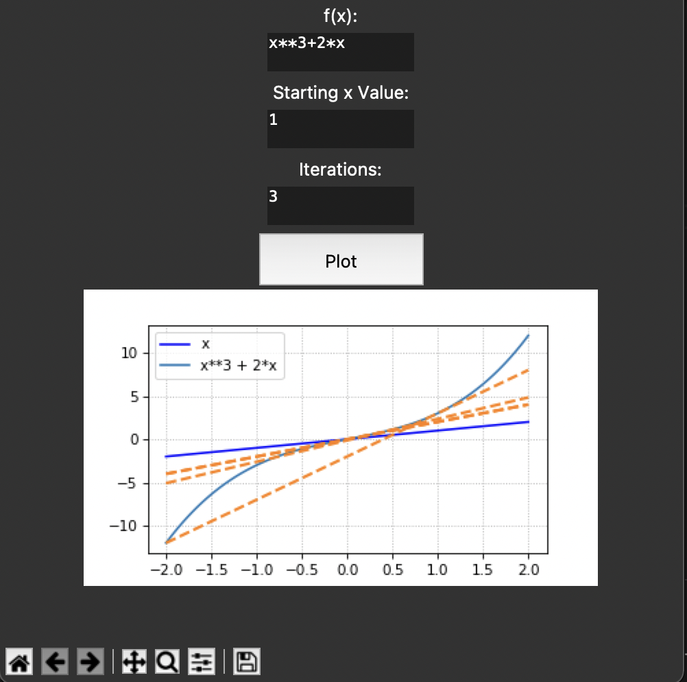
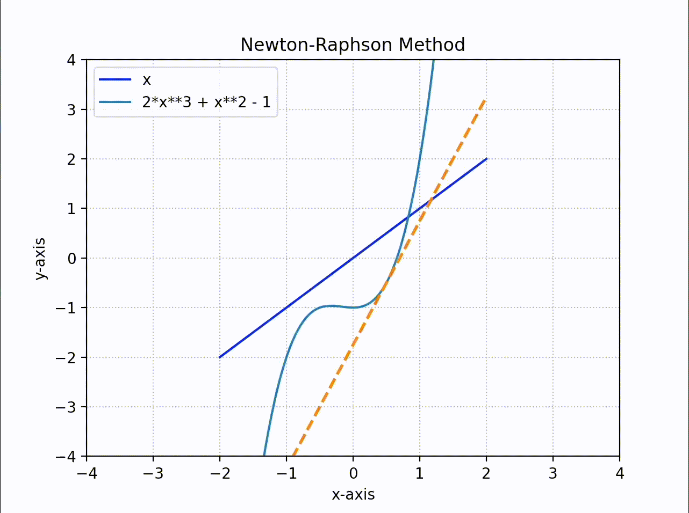

<p align="center"><a href="https://en.wikipedia.org/wiki/Newton%27s_method"></a></p>
<h1 align="center">The Newton Raphson Method</h1>

<p align="center"><a href="https://www.codefactor.io/repository/github/matthewkayne/newton-raphson-method"></a></p>

Solves a functions root using the Newton-Raphson method. It requires three parameters, the function, the x₀ value, and the number of iterations.

## ⚡️ Interactive Graph

This is an application that allows you to input aa function, x₀ value and number of iterations into a UI and see it graphed and solved.



Run [interactive\_\_graph.py](https://github.com/matthewkayne/newton-raphson-method/blob/master/interactive_graph.py) to see the graphical visualisation of the method

## 📈 Real Time Graph Function

This shows the real time lines being drawn when solving using the Newton-Raphson method



Run [newton_raphson_graph.py](https://github.com/matthewkayne/newton-raphson-method/blob/master/examples/newton_raphson_graph.py) to see the graphical visualisation of the method

## 🧠 Use The Base Function

To use the function, start by importing the function and sympy:

```python
from sympy import *
from newton_raphson import nr
```

Then setup your `x` symbol:

```python
x = Symbol('x')
```

Finally call the Newton-Raphson function

```python
nr((x**3 + 2*x - 2)), 1, 3)
```

See [newton_raphson.py](https://github.com/matthewkayne/newton-raphson-method/blob/master/newton_raphson.py) for the base function
